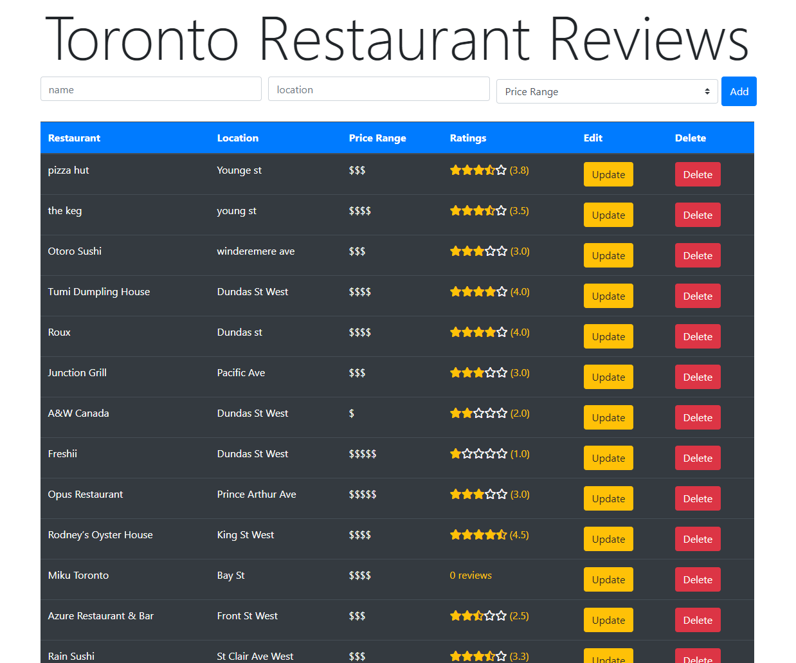

Live project here: https://toronto-reviews.herokuapp.com/

PERN stack (Postgres, Express React, Nodejs) CRUD application. Reviews for restaurants in Toronto with a star rating system. Uses elephantsql for the database server and the front end was deployed on Heroku. 

